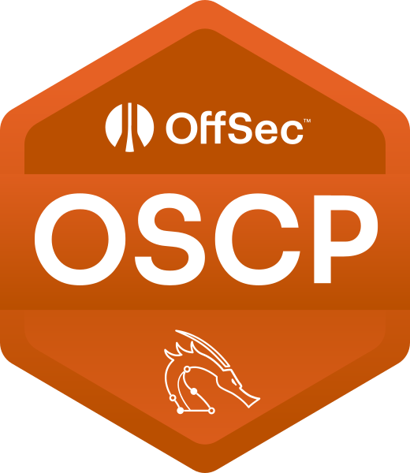
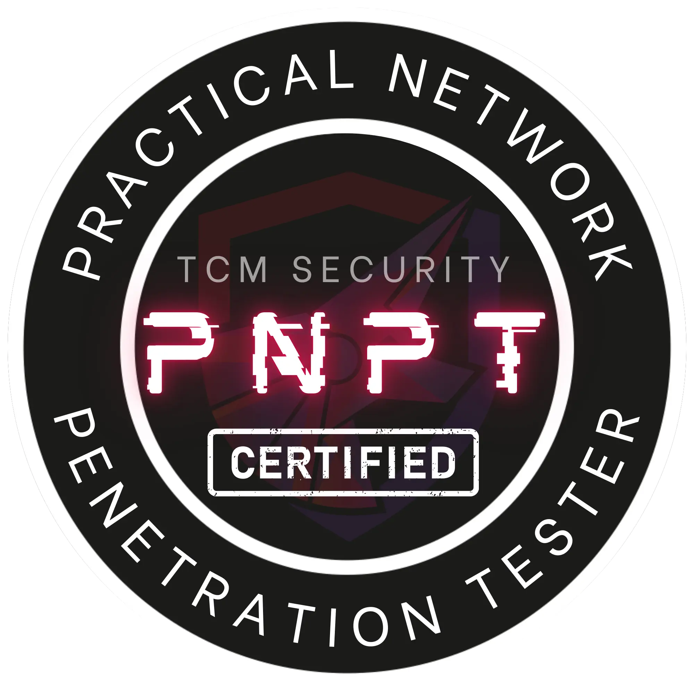
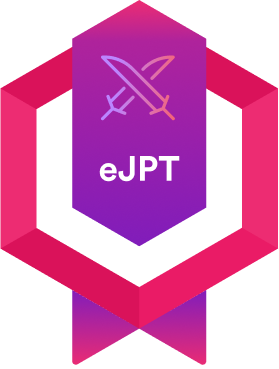
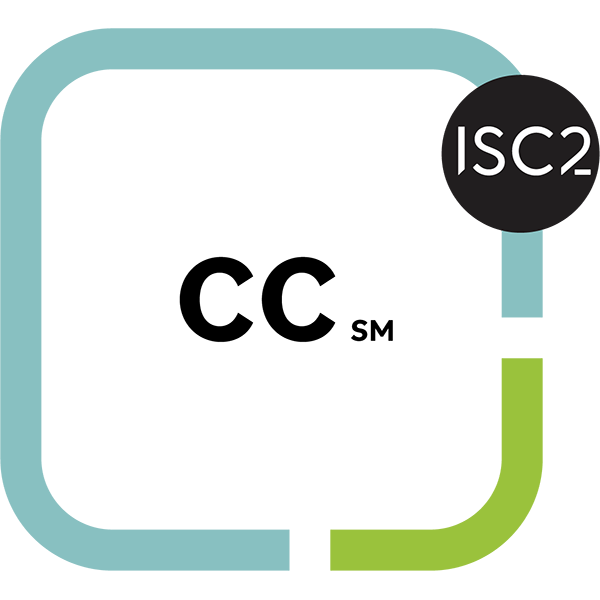
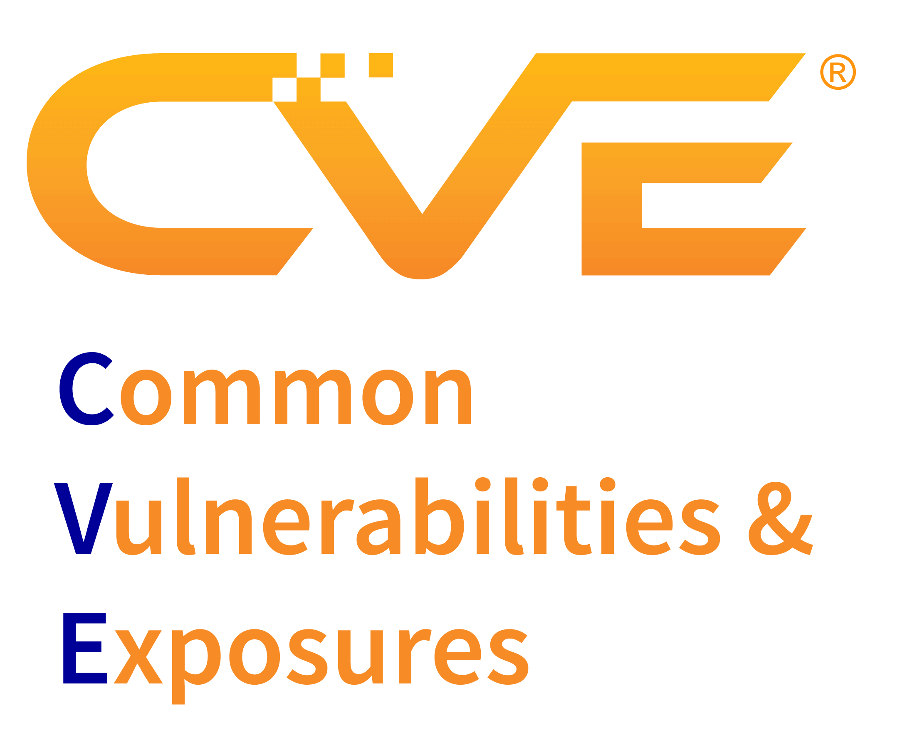

<!-- ===================================== -->
<!--           README – skypoc             -->
<!-- ===================================== -->

<h1 align="center">🛡About Me</h1>
<h3 align="center">Ethical Hacker&nbsp;|&nbsp;CVE Contributor&nbsp;|&nbsp;Red Team </h3>

  

## 🧭 About Me
- 🔭 Focusing on **advanced penetration testing & vulnerability research**  
- 💬 Happy to discuss **vuln assessment / bug bounty / attack & defense**  
- 🏆 Discovered **Bug Bounty and CVE**  

## 🏅 Certifications

  <!-- Replace with your own PNG/SVG or external links -->
  
  
  
  
  
  

## 🛠 Skill Matrix

| Red Team | Blue Team |  
|----------|-----------|
| Network&nbsp;PT Web&nbsp;PT Active&nbsp;Directory PT&nbsp; OSINT | Threat&nbsp;Hunting SIEM&nbsp;/&nbsp;EDR Incident&nbsp;Response | 

### Core Tools

  
  
  
  
  
  
  
  
  
  
  
  
  
  
  
  
  
  
  
  
  
  
  
  

## 🐞 CVE & Bug Bounty

- Published CVEs
- Hall of Fame & Awards
  - Fortune 500 Companies

## 🚀 Current Focus

| Area        | Topics                                                                                       |
|-------------|----------------------------------------------------------------------------------------------|
| **Research**| Zero-day&nbsp;&nbsp;•&nbsp; Cloud Security&nbsp;&nbsp;•&nbsp; AI/ML Security                |
| **Development** | Security Automation&nbsp;&nbsp;•&nbsp; Vulnerability Scanners                           |
| **Learning**| Advanced Threat Hunting&nbsp;&nbsp;•&nbsp; Malware Analysis                                  |
| **Goals**   | Community Contribution&nbsp;&nbsp;•&nbsp; Mentorship&nbsp;&nbsp;•&nbsp; Continuous Improvement|

## 📂 Featured Projects

  
  
   
     

